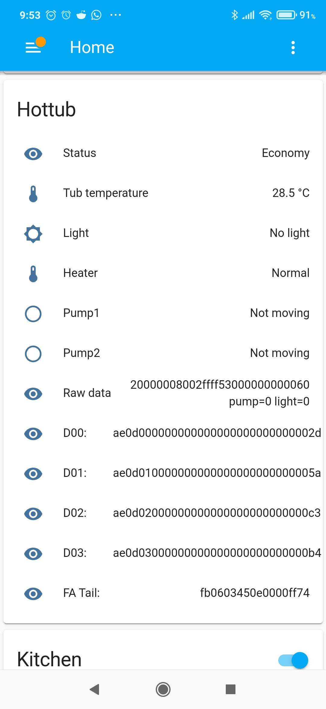

# Balboa GL ML Spa Control

While there is the excellent https://github.com/ccutrer/balboa_worldwide_app project that handled the new WiFi capable BP range of controllers, this is *NOT* compatible with the older GL/EL range such as the GL2000.

The aim of this project is to achieve similar results

## Current state
App for ESP32 or ESP8266 that sends current status including temperature to Home Assistant and also simple web status page with live updates via WebSocket

# Source Info
Original discssion regarding support for spa controllers with 8 pin rather than 4 pin main panels
* 8-pin Molex https://github.com/ccutrer/balboa_worldwide_app/issues/14

# Connection
* Pin 1+3 - RS485
* Pin 2,4 - Unknown
* Pin 5 - Clock?
* Pin 6   - 9.7V - PSU? - limited current avail
* Pin 7+8 - GND
