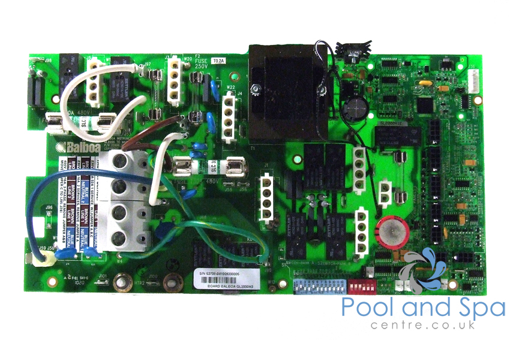

# Balboa GL ML Spa Control

While there is the excellent https://github.com/ccutrer/balboa_worldwide_app project that handled the new WiFi capable BP range of controllers, this is *NOT* compatible with the older GL/EL range such as the GL2000.

At the moment this protect is just to pull together the information that has been established.

# Source Info
Original discssion regarding support for spa controllers with 8 pin rather than 4 pin main panels
* 8-pin Molex https://github.com/ccutrer/balboa_worldwide_app/issues/14

# Connection
* Pin 1+3 - RS485
* Pin 2,4,5 - Unknown
* Pin 6   - 9.7V - PSU?
* Pin 7+8 - GND
